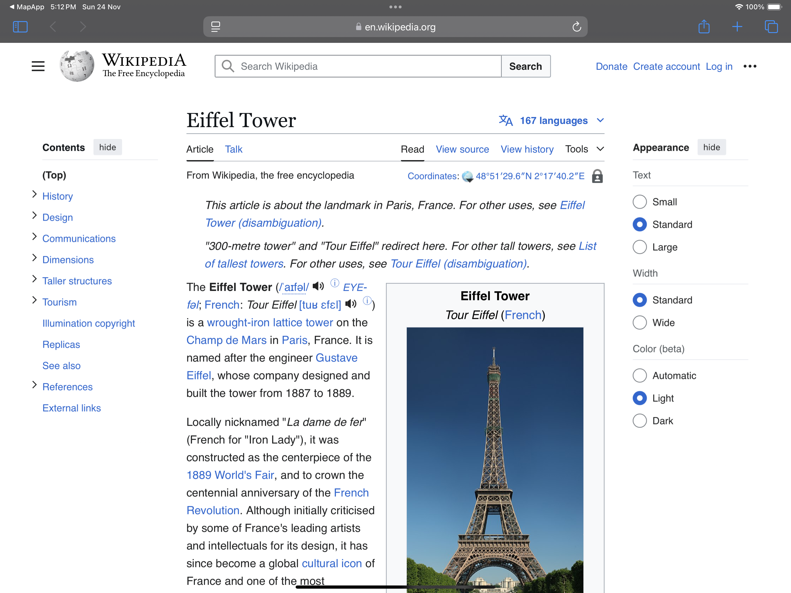

# Mapify: Explore Global Destinations with Style

<div align="center">
    
    <h1>Mapify</h1>
    <p><b>Mapify</b> is an iOS app built with SwiftUI that showcases global landmarks using MapKit and JSON-based location data. It features interactive maps, custom animated pins, and immersive detail screens to explore destinations like the Eiffel Tower and the Colosseum. With a clean, user-friendly interface and adaptive design, Mapify offers a visually stunning experience for discovering real-world destinations.</p>
  <p>Discover iconic landmarks worldwide with <b>Mapify</b>, a SwiftUI-powered app designed to showcase famous destinations like the Eiffel Tower and the Colosseum. Featuring interactive maps, custom pins, and a sleek design, Mapify offers a visually stunning and user-friendly experience.</p>
</div>

## 📱 Features

- **Interactive Maps**: Navigate and explore famous destinations with interactive mapping.
- **Custom Pins**: Beautiful animated pins highlight landmarks with a unique touch.
- **Preview Cards**: Get quick details about selected locations through elegant preview cards.
- **Dynamic Navigation**: Use a scrollable menu to jump to specific destinations seamlessly.
- **Dedicated Detail Screen**: Learn more about each location with immersive details.
- **Adaptive Design**: Fully compatible with iPads, landscape mode, and dark mode.

## 🖥️ Screenshots

### iPhone 

&emsp;&emsp;&emsp;
&emsp;&emsp;&emsp;
&emsp;


### iPad

&emsp;&emsp;

&emsp;&emsp;

&emsp;&emsp;

&emsp;&emsp;

&emsp;&emsp;

## 🛠️ Technologies Used

- **SwiftUI**: Harnessing the power of declarative UI for a responsive and adaptive interface.
- **MapKit**: Interactive maps with custom annotations and seamless navigation.
- **MVVM Architecture**: Clean and scalable code structure.
- **Animations**: Smooth transitions and animations for an enhanced user experience.
- **JSON Parsing**: Efficient data handling for pre-defined location details.


## 📄 Documentation

Dive into the complete guide for Mapify, where you'll find step-by-step setup instructions, in-depth code explanations, and insights into the SwiftUI features used. Check out the full article on Medium:

[Mapify: Creating a Stunning SwiftUI Map App for Real-World Destinations](https://medium.com/@seher.ayesha/mapify-creating-a-stunning-swiftui-map-app-for-real-world-destinations-decf445f459e)

## 🚀 Getting Started

### Prerequisites

- macOS with Xcode 13+ installed.
- Basic knowledge of Swift and SwiftUI.

### Installation

1. **Clone the Repository:** Open your terminal and run the following command to clone the repository:
```bash
   git clone https://github.com/seher-ayesha/mapify.git
```

2. **Navigate to the Project Directory and open the project:** Change to the project directory:

```bash
  cd mapify
  open MapApp.xcodeproj
```

3. **Run the Application:**

- Ensure you have Xcode installed on your machine.
- Select a simulator or a connected device.
- Click the "Run" button in Xcode to build and run the application.

## 🤝 Contribution

We welcome contributions! Here are some ways you can help make WeatherWonders even better:

- **Report Bugs:** If you encounter any issues, please open an issue to let us know.
- **Contribute Code:** If you’re a developer, follow the instructions below to get started!
- **Make Suggestions:** Have ideas for improvements? Open an issue with your ideas.
- **Improve Documentation:** Feel free to add or clarify documentation.

If you have a suggestion that would make this better, please fork the repo and create a pull request. You can also simply open an issue with the tag "enhancement". Don't forget to give the project a star! Thanks again!

### Instructions

1. Fork this repository.
2. Clone the forked repository.
3. Create your Feature Branch 

```bash
git checkout -b feature/AmazingFeature
```

4. Commit your Changes 

```bash
git commit -m 'Add some AmazingFeature'
```

5. Push to the Branch 

```bash
git push origin feature/AmazingFeature
```

6. Open a Pull Request.---

## 🌟 Future Enhancements  

Here are the top enhancements planned to take **Mapify** to the next level:

1. **User Location Tracking**  
   - Integrate real-time tracking of the user's location on the map for enhanced interactivity.  
   - Display distance and estimated travel time to landmarks based on the user's location.  

2. **Search Functionality**  
   - Add dynamic search capabilities for landmarks or cities.  
   - Implement autocomplete suggestions to improve user experience and navigation.  

3. **Augmented Reality (AR) Integration**  
   - Introduce an AR mode, allowing users to explore landmarks through their device camera with overlaid information.  
   - Leverage ARKit to bring destinations to life.  

4. **3D Map Overlays**  
   - Incorporate 3D map views to provide a more immersive exploration experience.  
   - Highlight the topography and detailed terrain of the surrounding areas.  

5. **Offline Mode**  
   - Enable offline access for pre-saved locations and basic map functionality.  
   - Ideal for travelers in regions with limited or no internet connectivity.  

---

## 👏 Credits
Developed by [Seher Ayesha](https://github.com/seher-ayesha)

## 🛡️ License

This project is licensed under the MIT License - please see the [LICENSE.md](https://github.com/seher-ayesha/mapify/blob/main/LICENSE.md) file for details.


